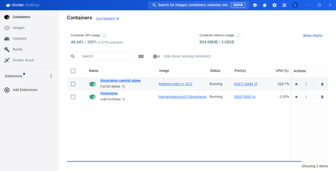
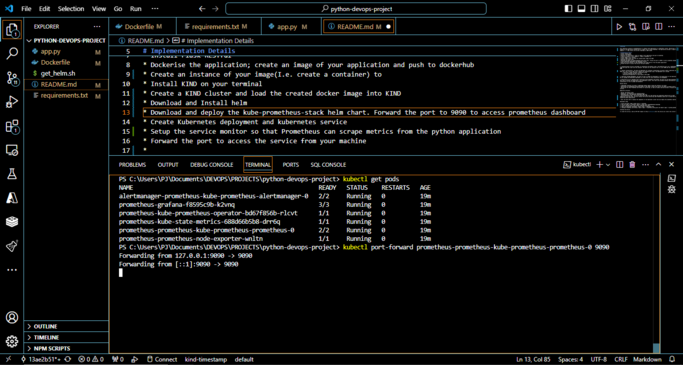
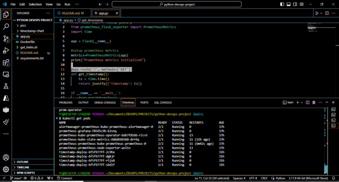
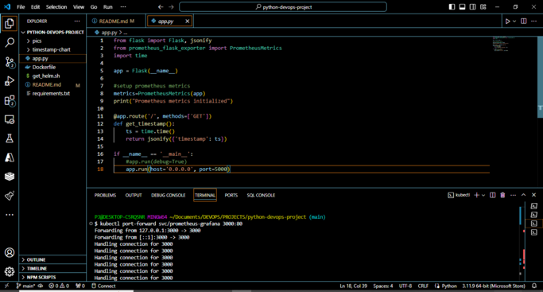
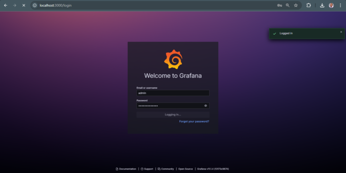
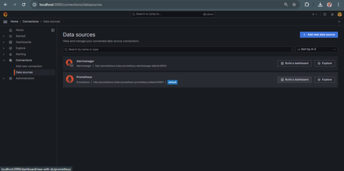
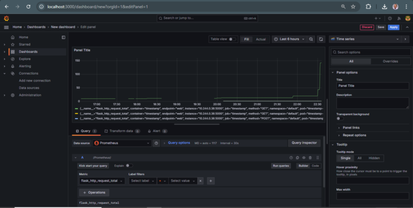
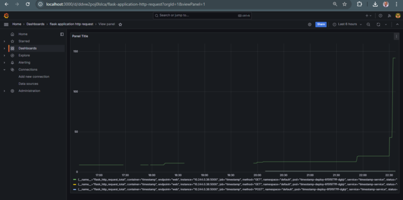

# Python Flask Application in Kubernetes with Prometheus Monitoring

## Overview

This repository contains an implementation of a Python Flask application deployed in a Kubernetes cluster. Monitoring is enabled through Prometheus, which scrapes metrics from the application. The application provides a single API endpoint (`/`) that returns the current timestamp in JSON format.

## Implementation Details

### Prerequisites

1. **Python and Flask Setup:**
   - Install Python and Flask:
     ```bash
     pip install Flask
     pip install Flask-RESTful
     ```

2. **Dockerize the Application:**
   - Create a Docker image of the python application and push it to DockerHub.
   - Ensure the application runs correctly by creating a container instance.
     ```bash
     docker build -t <your-dockerhub-username>/timestamp .
     docker push <your-dockerhub-username>/timestamp
     docker run -p 5000:5000 <your-dockerhub-username>/timestamp
     ```

    
    
3. **Kubernetes Setup:**
   - Install KIND (Kubernetes IN Docker) on your terminal.
     ```bash

     curl.exe -Lo kind-windows-amd64.exe https://kind.sigs.k8s.io/dl/v0.24.0/kind-windows-amd64

     Move-Item .\kind-windows-amd64.exe c:\some-dir-in-your-PATH\kind.exe

     ```
   - Create a KIND cluster and load the Docker image into it.
     ```bash
     kind create cluster --name timestamp
     kind load docker-image lukmanadeokun31/timestamp
     ```

     

     

4. **Helm Installation:**
   - Download and install Helm, a Kubernetes package manager.
     ```bash
     curl https://raw.githubusercontent.com/helm/helm/main/scripts/get-helm-3 | bash
     ```

5. **Deploy Prometheus:**
   - Download and deploy the `kube-prometheus-stack` Helm chart.
     ```bash
     helm repo add prometheus-community https://prometheus-community.github.io/helm-charts
     helm repo update
     helm install prometheus prometheus-community/kube-prometheus-stack
     kubectl port-forward svc/prometheus-kube-prometheus-prometheus 9090:9090
     ```

     


     

      
## Deployment using Helm Chart

1. **Create a Helm Chart for the Application:**
   - Generate a Helm chart:
     ```bash
     helm create timestamp-chart
     ```
   - Add Kubernetes deployment and service files (`deployment.yaml` and `service.yaml`) to the `timestamp-chart/templates/` directory.

   

2. **Deploy the Application:**
   - Install the application using Helm:
     ```bash
     helm install timestamp ./timestamp-chart
     ```
   - Access the application by forwarding the port from your local machine to the service in the Kubernetes cluster:
     ```bash
     kubectl port-forward svc/timestamp-service 5000:80
     ```

.png)

.png)


## Monitoring, Observability and Visualisation


### Prometheus Integration

1. **ServiceMonitor Configuration:**
   - Set up a `ServiceMonitor` so that Prometheus can scrape metrics from the Python application. This is the preferred method for adding scrape targets in Kubernetes.


2. **Prometheus Operator:**
   - Use the Prometheus Operator to manage Prometheus instances and scrape configurations in Kubernetes.

3. **ServiceMonitor Setup:**
   - Ensure the `ServiceMonitor` references the service configuration correctly:
     - `spec.selector.matchLabels.app` should match the `labels.app` value in the service configuration.
     - `spec.endpoints.port` should match the `spec.ports.name` value in the service configuration.
     - `spec.jobLabel` should match the `metadata.labels.job` property.
   - Ensure the `metadata.label.release` value in the `ServiceMonitor` is set to `prometheus` to register it with Prometheus.

   .png)

4. **Update the Helm Release:**
   - Apply changes to the Helm chart and update the deployment:
     ```bash
     helm upgrade <release_name> <chart_path>
     helm upgrade timestamp ./timestamp-chart
     ```
     

     

     


### Grafana Integration
The grafana component is already included in the kube-prometheus-chart


Port-forward traffic to the grafana server


The grafana username is admin. The grafana password can be accessed through the command
`kubectl get secret prometheus-grafana -o jsonpath="{.data.admin-password}" | base64 --decode`


Accessing Grafana dashboard on localhost:3000



The Grafana dashboard


Adding the prometheus as a datasource to grafana


Querying the flask-http-request-total metric


Data visualisation of the flask-http-request-total metrics



## Design Choices

- **Lightweight Container:** A lightweight Python image is used to keep the container size small.
- **Autoscaling:** Autoscaling is based on CPU usage to ensure the service can handle increased traffic.
- **Monitoring:** Prometheus and Grafana are chosen for monitoring, providing a flexible and comprehensive monitoring solution.

## Repository Structure

- `app.py`: The Python application script.
- `Dockerfile`: Dockerfile for containerization.
- `deployment.yaml`: Kubernetes deployment YAML file.
- `service.yaml`: Kubernetes service definition YAML file, including service monitoring configuration.
- `requirements.txt` : A file containing the dependencies required to run the application.
- `timestamp-chart/`: Helm chart directory for deploying the application to the Kubernetes cluster.
- `timestamp-chart/Chart.yaml`: A yaml file in the helm chart directory that contains metadata about the helm chart called timestamp-chart
- `timestamp-chart/values.yaml`:A yaml file in the helm chart directory used to define values for templates and configurations in the timestamp-chart.
## Invoking the Service

To invoke the service,run  `kubectl port-forward svc/timestamp-service 5000:80` and  `kubectl port-forward prometheus-prometheus-kube-prometheus-prometheus-0 9090`. Send an HTTP GET request to `http://<service-ip>:80`. The service will return the current timestamp in JSON format.
